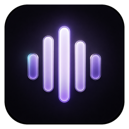
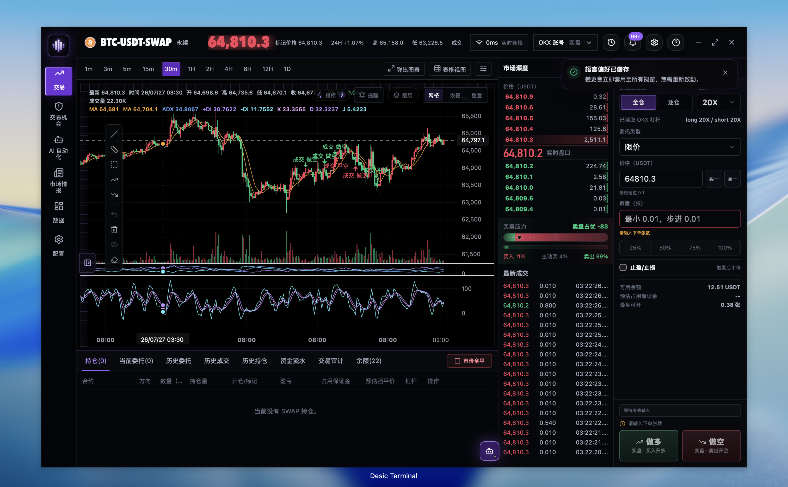
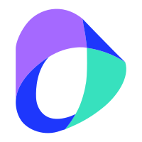
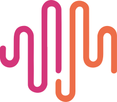
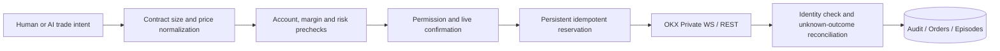
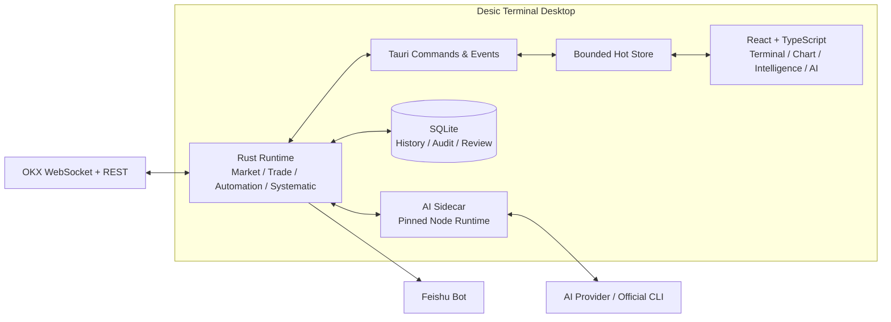
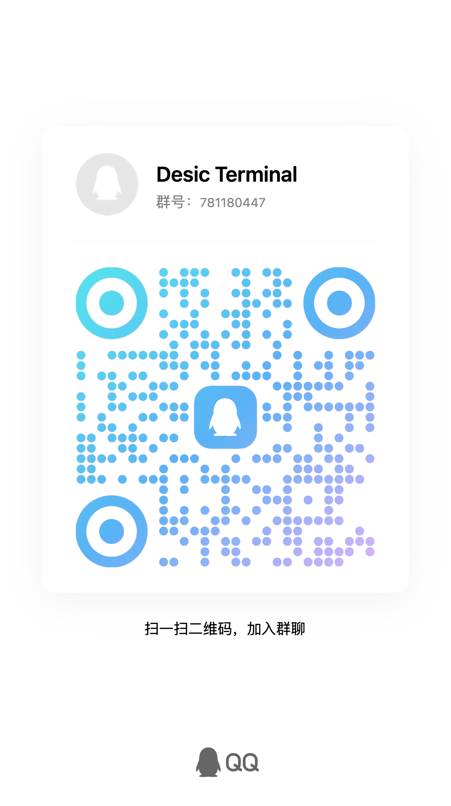

<div align="center">
  

  <h1>Desic Terminal</h1>

  <p>English (current) · <a href="./README.md">简体中文</a></p>

  <p><strong>An AI-native trading terminal for OKX USDT perpetual markets.</strong></p>
  <p>Market, charts, execution, intelligence, AI assistant, automation and systematic research share one real-time state and audit context.</p>

  <p>
    <strong><a href="https://desicterminal.cn/">Official Website</a></strong>
    · <a href="https://desicterminal.cn/#download">Download</a>
    · <a href="https://github.com/xiazhi88/Desic-Terminal/releases">Releases</a>
  </p>

  <p>
    
    
    
    
    
    
  </p>

  <p>
    <a href="#installation">Installation</a> ·
    <a href="#documentation">Documentation</a> ·
    <a href="#core-capabilities">Capabilities</a> ·
    <a href="#safety-and-execution-principles">Safety</a> ·
    <a href="#development">Development</a> ·
    <a href="#community-and-support">Community</a>
  </p>
</div>

[](https://desicterminal.cn/)

## Installation

Download the build for your platform:

| Platform | Package |
| --- | --- |
| Windows x64 | **[Download EXE installer](https://github.com/xiazhi88/Desic-Terminal/releases/latest/download/Desic-Terminal_Windows-x64-setup.exe)** |
| macOS Apple Silicon (M1+) | **[Download Apple Silicon DMG](https://github.com/xiazhi88/Desic-Terminal/releases/latest/download/Desic-Terminal_macOS-arm64.dmg)** |
| macOS Intel | **[Download Intel DMG](https://github.com/xiazhi88/Desic-Terminal/releases/latest/download/Desic-Terminal_macOS-x64.dmg)** |

See [GitHub Releases](https://github.com/xiazhi88/Desic-Terminal/releases) for release notes and all assets.

> [!IMPORTANT]
> Current packages are not signed with an Apple Developer ID or Windows Authenticode certificate. On first launch on macOS, drag the app into Applications, right-click it and choose Open; if still blocked, go to System Settings → Privacy & Security → Open Anyway. Windows may show a SmartScreen prompt — verify the download source before continuing.

## Documentation

| Document | Contents |
| --- | --- |
| 📖 [**Getting Started**](docs/getting-started.en.md) | From installation and demo account setup to your first trade, AI assistant and intelligence |
| 🤖 [**AI Automation Guide**](docs/ai-automation-guide.en.md) | Profiles, wake conditions, Skill versioning, multi-agent orchestration, reviews and iteration |
| 📈 [**Systematic Strategy Guide**](docs/systematic-strategy-guide.en.md) | Python strategy programming, backtesting, parameter tuning and live Profiles |
| 🔧 [Strategy Protocol](docs/systematic-python-strategy-protocol.md) | The authoritative runtime protocol, source policy and safety boundary (Chinese) |
| 🏗 [Product Spec](PRODUCT.md) | Product boundaries and key design decisions (Chinese) |

## Core Capabilities

| Workspace | Capabilities |
| --- | --- |
| **Live Trading** | OKX Public / Business / Private WebSocket, depth and trades, ticket, limit/market/algo orders, TP/SL, OCO, amend/cancel, position management |
| **Pro Charts** | Multi-timeframe candles, 24 indicators, layers and drawings, quick trading on chart, detached multi-chart windows, data table and CSV export |
| **AI Assistant** | Streaming reasoning, allowlisted tools, account and market evidence, trade opportunities, chart actions, safe DSL custom indicators, many providers and official CLI channels |
| **AI Automation** | Profiles, typed wake conditions, bounded auto-execution, run audit, multi-agent orchestration, position reviews, Skill versioning and optimization suggestions |
| **Systematic Strategy** | Zero-setup Python, template strategies, backtests over up to 366 days of 1-minute data, parameter tuning workbench, live Profiles and signal history |
| **Market Intelligence** | News, event clustering, coin sentiment, economic calendar, OI, taker flows, crowding, funding, basis, Smart Money and system stress |
| **Notifications & Recovery** | In-app notifications, Feishu bot, persisted execution state, unknown-outcome reconciliation, idempotent submission and startup recovery |

### Permissions are not prompts

| Mode | Read market & account | Trade opportunities | External trade side effects |
| --- | :---: | :---: | --- |
| `advisor` | Yes | No | Forbidden |
| `copilot` | Yes | Create, edit, reuse | User approval required |
| `limited_auto` | Yes | Frozen-candidate submission | Profile-authorized scope only |

Every model call passes through sidecar tool visibility, agent runtime policy, Rust account/environment binding, contract parameter validation, trade prechecks, live confirmation, idempotency control and persistent audit.

## Supported AI Providers

Desic Terminal works with the model services below through Provider APIs, and can also delegate requests through a locally installed official Codex CLI or Claude Code.

<table>
  <tr>
    <td align="center" width="25%"><br /><strong>OpenAI</strong><br /><sub>API / Codex CLI</sub></td>
    <td align="center" width="25%"><br /><strong>Claude</strong><br /><sub>API / Claude Code</sub></td>
    <td align="center" width="25%"><br /><strong>Gemini</strong><br /><sub>Google AI</sub></td>
    <td align="center" width="25%"><br /><strong>Grok</strong><br /><sub>xAI</sub></td>
  </tr>
  <tr>
    <td align="center"><br /><strong>DeepSeek</strong><br /><sub>DeepSeek AI</sub></td>
    <td align="center"><br /><strong>Qwen</strong><br /><sub>Alibaba Cloud Bailian</sub></td>
    <td align="center"><br /><strong>KIMI</strong><br /><sub>Moonshot AI</sub></td>
    <td align="center"><br /><strong>Doubao</strong><br /><sub>Volcano Ark</sub></td>
  </tr>
  <tr>
    <td align="center"><br /><strong>MiniMax</strong><br /><sub>Anthropic-compatible</sub></td>
    <td align="center"><br /><strong>GLM (Zhipu)</strong><br /><sub>Zhipu AI</sub></td>
    <td align="center"><br /><strong>Custom</strong><br /><sub>Compatible API</sub></td>
  </tr>
</table>

## Safety and Execution Principles

Desic Terminal treats "unknown outcome" as its own state rather than a simple success or failure. After an external write times out, the system reconciles using the stable execution key, client order ID, account identity and an OKX query; a risk-increasing operation is never blindly retried under a new execution key before the outcome is clear.



- API keys must not include withdrawal permission.
- Demo and live use separate credentials and confirmation states.
- Risk-increasing operations fail closed; risk-reducing paths such as closing stay available.
- Delegated agents are always read-only and cannot gain extra permissions through task text.
- Logs, errors and diagnostics are redacted for sensitive fields before being written.

## Architecture



High-frequency ticker, order book and trades never reach React state one message at a time. The Rust runtime owns sequence, checksum, time sync and bounded micro-batching; the frontend receives drawable snapshots. Historical candles, orders, fills, reviews and audit live in SQLite for continuous context, and the AI sidecar only exposes the tool set the current permission allows.

Source layout:

```text
src/                         React UI, chart adaptation, state and desktop call wrappers
src-tauri/src/               Tauri commands, events, external IO and runtime orchestration
src-tauri/crates/            Trading domain, chart DSL, intelligence and automation modules
scripts/                     AI sidecar, provider adapters, strategy tests and smoke suites
docs/                        User guides and development documentation
```

## Development

The project is under active development. The repository ships CI pipelines for Windows x64, macOS Apple Silicon and macOS Intel installers plus signed updater artifacts; treat the builds actually published and platform-verified on GitHub Releases as authoritative. Development requires Node.js, npm, Rust stable, and the platform dependencies of Tauri 2.

```bash
npm install
npm run prepare:sidecar
npm run tauri dev
```

Frontend preview only:

```bash
npm run dev
```

Minimum verification before committing:

```bash
npm run build
cargo check --manifest-path src-tauri/Cargo.toml --workspace
npm run test:ai-policy
npm run smoke:config-security
```

Run the smoke suites relevant to your change as well. See [PRODUCT.md](PRODUCT.md) and the [development guidelines](docs/development-guidelines.md) for architecture, safety and trading constraints.

## Project Status

The current scope is OKX USDT linear perpetuals on Windows and macOS desktops. Other exchanges, spot, options and mobile are out of scope for now. Automated execution is a high-risk capability: start from `advisor` mode and a demo account, then raise privileges gradually based on run records, reconciliation and position reviews.

## Related Projects

### Desic OKX Agent

[Desic OKX Agent](https://github.com/xiazhi88/desic-okx-agent) is a standalone local OKX MCP project that lets Codex, Claude Code and other AI agents fetch market data, query accounts or execute trades directly. It is not part of Desic Terminal. Requires Node.js 22.12+:

```bash
npm install --global desic-okx-agent
desic-okx setup
```

After setup you can ask the agent directly:

```text
Use the Desic OKX Agent to read the live price, order book, 1-hour candles, funding rate and open interest of BTC-USDT-SWAP, give a concise analysis with data timestamps; if you propose a trade, run the prechecks first and wait for my explicit confirmation before placing any order.
```

Public market data needs no account. For account and trading features, run `desic-okx account add` in your own terminal and never send API keys, secrets or passphrases in chat.

## Community and Support

If Desic Terminal helps you, please consider starring the project on GitHub — **[Star](https://github.com/xiazhi88/Desic-Terminal)** helps more traders and developers find it.

### QQ Group

QQ group: `781180447`



### OKX Referral

Register through the **[OKX referral link](https://www.okx.com/zh-hans/join/xiazhi?shortCode=6CngT5)** and meet the campaign rules for up to 15% rebate. Eligibility, ratio and validity are subject to the rules shown on the OKX page.

## Disclaimer

This software is for educational purposes only. USE THE SOFTWARE AT YOUR OWN RISK. THE AUTHORS AND ALL AFFILIATES ASSUME NO RESPONSIBILITY FOR YOUR TRADING RESULTS. Do not risk money that you are afraid to lose. There might be bugs in the code - this software DOES NOT come with ANY warranty.

## License

Desic Terminal source code is open source under the [MIT License](LICENSE). Third-party dependencies and assets keep their own licenses — see [THIRD_PARTY_NOTICES.md](THIRD_PARTY_NOTICES.md); the MIT License grants no trademark rights to the Desic Terminal name, logo or brand.

---

<div align="center">
  <strong>Desic Terminal</strong><br />
  Observe with context. Execute with control. Improve with evidence.
</div>
