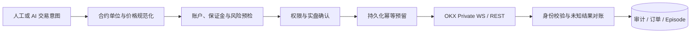
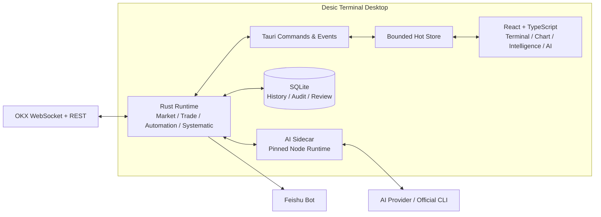

<div align="center">
  

  <h1>Desic Terminal</h1>

  <p><a href="./README.en.md">English</a> · 简体中文（当前）</p>

  <p><strong>AI 原生的 OKX USDT 永续合约交易终端。</strong></p>
  <p>行情、图表、交易、情报、AI 助手、自动化与策略研究共享同一份实时状态与审计上下文。</p>

  <p>
    <strong><a href="https://desicterminal.cn/">官方网站</a></strong>
    · <a href="https://desicterminal.cn/#download">官网下载</a>
    · <a href="https://github.com/xiazhi88/Desic-Terminal/releases">版本发布</a>
  </p>

  <p>
    
    
    
    
    
    
  </p>

  <p>
    <a href="#安装">安装</a> ·
    <a href="#文档">文档</a> ·
    <a href="#核心能力">核心能力</a> ·
    <a href="#安全与执行原则">安全</a> ·
    <a href="#开发">开发</a> ·
    <a href="#社区与支持">社区</a>
  </p>
</div>

[](https://desicterminal.cn/)

## 安装

推荐直接下载与操作系统匹配的构建版本：

| 平台 | 安装包 |
| --- | --- |
| Windows x64 | **[下载 EXE 安装程序](https://github.com/xiazhi88/Desic-Terminal/releases/latest/download/Desic-Terminal_Windows-x64-setup.exe)** |
| macOS Apple Silicon（M1 及更新芯片） | **[下载 Apple Silicon DMG](https://github.com/xiazhi88/Desic-Terminal/releases/latest/download/Desic-Terminal_macOS-arm64.dmg)** |
| macOS Intel | **[下载 Intel DMG](https://github.com/xiazhi88/Desic-Terminal/releases/latest/download/Desic-Terminal_macOS-x64.dmg)** |

也可以前往 **[GitHub Releases](https://github.com/xiazhi88/Desic-Terminal/releases)** 查看版本说明和全部附件。

> [!IMPORTANT]
> 当前安装包尚未使用 Apple Developer ID 或 Windows Authenticode 签名。macOS 首次启动时，请将应用拖入"应用程序"，右键应用选择"打开"；如果仍被拦截，请前往"系统设置 → 隐私与安全性"选择"仍要打开"。Windows 首次安装可能显示 SmartScreen 提示，请确认下载地址属于本仓库后再选择继续运行。

## 文档

| 文档 | 内容 |
| --- | --- |
| 📖 [**入门教程**](docs/getting-started.md) | 从安装、配置模拟盘、第一笔交易到 AI 助手与情报，一步步上手 |
| 🤖 [**AI 自动化指南**](docs/ai-automation-guide.md) | Profile、唤醒条件、Skill 版本、多 Agent、复盘与迭代的完整使用指导 |
| 📈 [**系统化策略指南**](docs/systematic-strategy-guide.md) | Python 策略编程、回测、参数调优与实盘 Profile 的完整工作流 |
| 🔧 [策略协议规范](docs/systematic-python-strategy-protocol.md) | 策略运行时协议、源码策略与安全边界的权威规范 |
| 🏗 [产品规范](PRODUCT.md) | 产品边界与关键设计决策 |

## 核心能力

| 工作域 | 能力 |
| --- | --- |
| **实时交易** | OKX Public / Business / Private WebSocket、深度与逐笔、交易票、限价/市价/计划委托、止盈止损、OCO、改单撤单、持仓管理 |
| **专业图表** | 多周期 K 线、24 个主副图指标、图层与绘图、图表快速交易、多图表独立窗口、K 线数据表与 CSV 导出 |
| **AI 助手** | 流式推理、白名单工具、账户与市场证据读取、交易机会、图表动作、安全 DSL 自定义指标、多供应商与官方 CLI 通道 |
| **AI 自动化** | Profile、类型化唤醒条件、受限自动执行、运行审计、多 Agent 编排、仓位复盘、Skill 版本与优化建议 |
| **系统化策略** | 免安装 Python、模板策略、最长 366 天 1 分钟级回测、参数调优工作台、实盘 Profile 与信号历史 |
| **市场情报** | 新闻、事件聚类、币种情绪、经济日历、OI、主动流、拥挤度、资金费率、基差、Smart Money 与系统压力 |
| **通知与恢复** | 应用内通知、飞书机器人、持久化执行状态、未知结果对账、幂等提交与启动恢复 |

### 权限不是提示词

| 模式 | 读取市场与账户 | 交易机会 | 外部交易副作用 |
| --- | :---: | :---: | --- |
| `advisor` | 是 | 否 | 禁止 |
| `copilot` | 是 | 创建、修改、复用 | 必须由用户审批 |
| `limited_auto` | 是 | 通过冻结候选提交 | 仅限 Profile 授权范围 |

模型调用依次经过 Sidecar 工具可见性、Agent runtime policy、Rust 账户与环境绑定、合约参数校验、交易预检、实盘确认、幂等控制和持久化审计。

## 支持的 AI 供应商

Desic Terminal 可以通过 Provider API 使用下列模型服务，也支持通过本机官方 Codex CLI 与 Claude Code 委托请求。

<table>
  <tr>
    <td align="center" width="25%"><br /><strong>OpenAI</strong><br /><sub>API / Codex CLI</sub></td>
    <td align="center" width="25%"><br /><strong>Claude</strong><br /><sub>API / Claude Code</sub></td>
    <td align="center" width="25%"><br /><strong>Gemini</strong><br /><sub>Google AI</sub></td>
    <td align="center" width="25%"><br /><strong>Grok</strong><br /><sub>xAI</sub></td>
  </tr>
  <tr>
    <td align="center"><br /><strong>DeepSeek</strong><br /><sub>深度求索</sub></td>
    <td align="center"><br /><strong>通义千问</strong><br /><sub>阿里云百炼</sub></td>
    <td align="center"><br /><strong>KIMI</strong><br /><sub>Moonshot AI</sub></td>
    <td align="center"><br /><strong>豆包</strong><br /><sub>火山方舟</sub></td>
  </tr>
  <tr>
    <td align="center"><br /><strong>MiniMax</strong><br /><sub>Anthropic 兼容</sub></td>
    <td align="center"><br /><strong>GLM（智谱）</strong><br /><sub>智谱 AI</sub></td>
    <td align="center"><br /><strong>自定义</strong><br /><sub>兼容接口</sub></td>
  </tr>
</table>

## 安全与执行原则

Desic Terminal 将"不确定结果"视为独立状态，而不是简单的成功或失败。一次外部写入超时后，系统会使用稳定执行键、客户端订单 ID、账户身份和 OKX 查询进行对账；在结果明确前，不会用新的执行键自动重试风险增加操作。



- API Key 不应包含提现权限。
- 模拟盘与实盘使用独立凭据和确认状态。
- 风险增加操作失败关闭；平仓等风险降低路径保持可用。
- delegated Agent 永远只读，不能通过任务文本获得额外权限。
- 日志、错误和诊断信息在写入前执行敏感字段脱敏。

## 架构



高频 ticker、盘口和逐笔不会逐条写入 React 状态。Rust 运行时负责 sequence、checksum、时间同步和有界微批；前端只接收可绘制快照。历史 K 线、订单、成交、复盘和审计由 SQLite 提供连续上下文，AI Sidecar 只暴露当前权限允许的工具集合。

核心代码边界：

```text
src/                         React UI、图表适配、状态与桌面调用封装
src-tauri/src/               Tauri command、事件、外部 IO 与运行时编排
src-tauri/crates/            交易领域、图表 DSL、情报与自动化领域模块
scripts/                     AI Sidecar、Provider 适配、策略测试与 smoke tests
docs/                        使用文档与开发规范
```

## 开发

当前项目处于持续开发阶段。仓库已经配置 Windows x64、macOS Apple Silicon 与 macOS Intel 的安装包和安全更新产物流水线；正式安装包仍以 GitHub Releases 中实际发布并完成平台验证的版本为准。开发环境需要 Node.js、npm、Rust stable，以及 Tauri 2 对应的平台依赖。

```bash
npm install
npm run prepare:sidecar
npm run tauri dev
```

仅运行前端预览：

```bash
npm run dev
```

提交前最低验证：

```bash
npm run build
cargo check --manifest-path src-tauri/Cargo.toml --workspace
npm run test:ai-policy
npm run smoke:config-security
```

与改动直接相关的测试和 smoke suite 也必须运行。架构、安全与交易约束见 [PRODUCT.md](PRODUCT.md) 和 [开发规范](docs/development-guidelines.md)。

## 项目状态

当前聚焦 OKX USDT 线性永续、Windows 与 macOS 桌面端。多交易所、现货、期权和移动端不在现阶段范围内。自动化执行属于高风险能力，应从 `advisor` 和模拟盘开始验证，并根据运行记录、对账与仓位复盘逐步提升权限。

## 相关项目

### Desic OKX Agent

[Desic OKX Agent](https://github.com/xiazhi88/desic-okx-agent) 是独立的本地 OKX MCP 项目，方便 Codex、Claude Code 等 AI Agent 直接获取行情、查询账户或执行交易。它不是 Desic Terminal 的组成部分。要求 Node.js 22.12 或更高版本：

```bash
npm install --global desic-okx-agent
desic-okx setup
```

安装完成后，可以直接向 Agent 提问：

```text
使用 Desic OKX Agent 读取 BTC-USDT-SWAP 的实时价格、盘口、1 小时 K 线、资金费率和持仓量，给出简洁分析并标注数据时间；如提出交易方案，先完成预检并等待我明确确认，不要直接下单。
```

公共行情无需配置账户。账户和交易功能请在自己的终端中运行 `desic-okx account add`，不要在聊天中发送 API Key、Secret 或 Passphrase。

## 社区与支持

如果 Desic Terminal 对你有帮助，欢迎在 GitHub 为项目点亮 **[Star](https://github.com/xiazhi88/Desic-Terminal)**。Star 能帮助更多交易者和开发者发现项目。

### QQ 交流群

QQ群：`781180447`


### OKX 专属邀请

通过 **[OKX 专属注册链接](https://www.okx.com/zh-hans/join/xiazhi?shortCode=6CngT5)** 注册并满足活动规则，可享 15% 返佣。具体资格、比例和有效期以 OKX 页面展示的规则为准。

## 免责声明

本软件仅供学习研究使用，使用风险由使用者自行承担。作者及所有关联方对您的交易结果不承担任何责任。请勿投入您无法承受损失的资金。代码可能存在缺陷——本软件不附带任何形式的保证。

## License

Desic Terminal 源代码基于 [MIT License](LICENSE) 开源。第三方依赖和素材仍遵循各自的许可证，概览见 [THIRD_PARTY_NOTICES.md](THIRD_PARTY_NOTICES.md)，完整许可清单随安装包分发并可在应用内"关于 → 开源许可"查看；MIT License 不授予 Desic Terminal 名称、Logo 或品牌标识的商标使用权。

---

<div align="center">
  <strong>Desic Terminal</strong><br />
  Observe with context. Execute with control. Improve with evidence.
</div>
