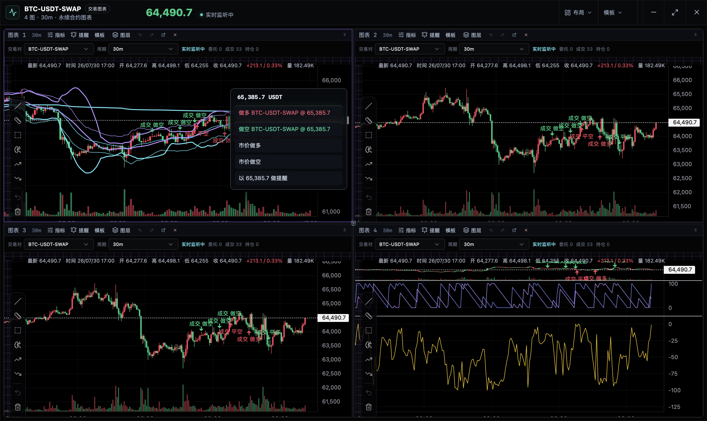
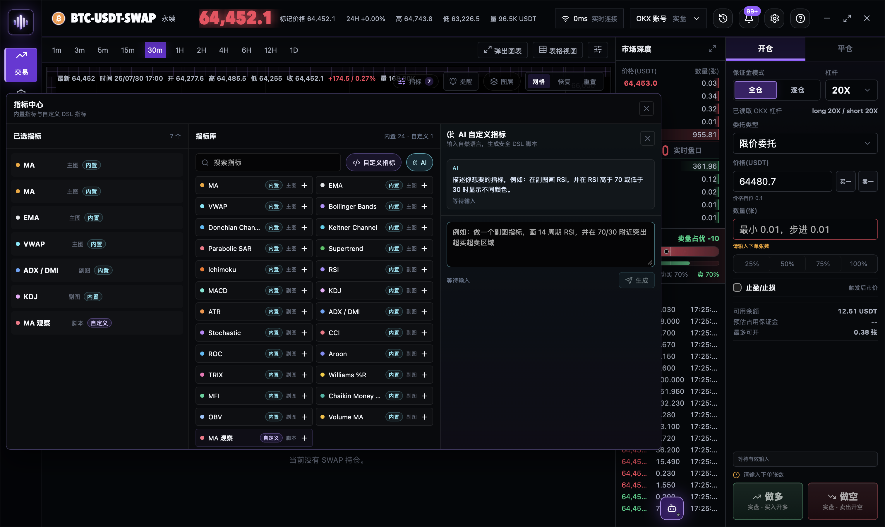
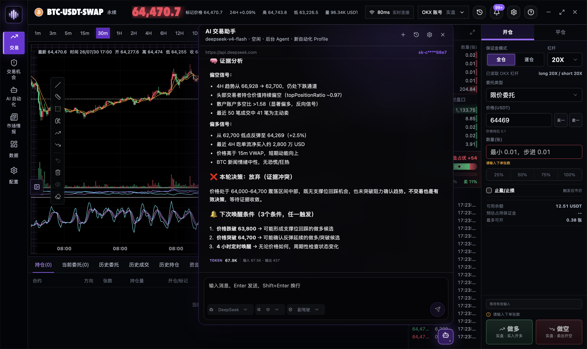
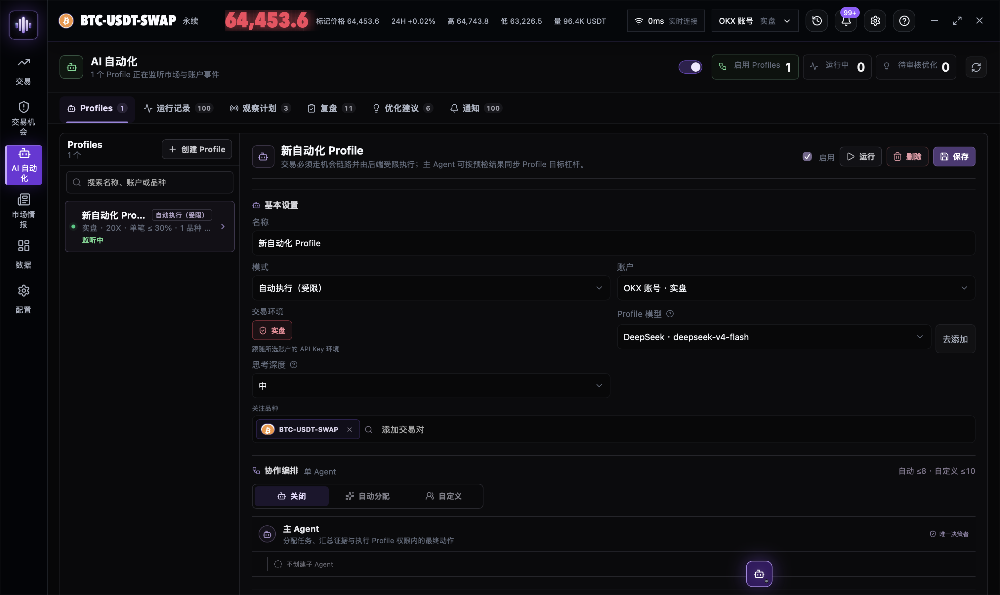
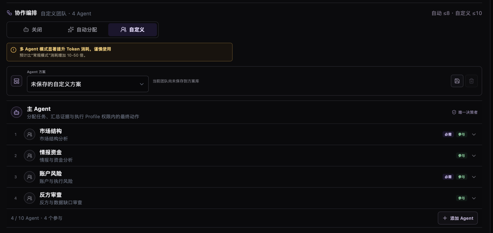
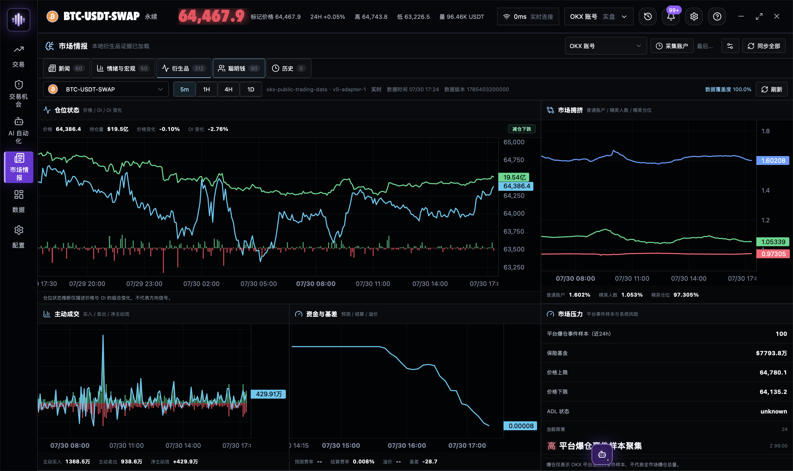
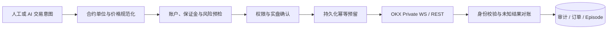
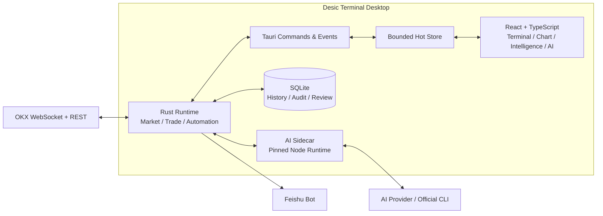

<div align="center">
  

  <h1>Desic Terminal</h1>

  <p><strong>An AI-native trading terminal for OKX USDT perpetual markets.</strong></p>
  <p>专业图表、交易执行、市场情报与受控 AI 自动化，共享同一份实时状态与审计上下文。</p>

  <p>
    
    
    
    
    
    
  </p>

  <p>
    <a href="#安装">安装</a> ·
    <a href="#软件演示">软件演示</a> ·
    <a href="#交易工作站">交易工作站</a> ·
    <a href="#ai-交易助手">AI 交易助手</a> ·
    <a href="#支持的-ai-供应商">AI 供应商</a> ·
    <a href="#自动化与多-agent">自动化</a> ·
    <a href="#市场情报">市场情报</a> ·
    <a href="#社区与支持">社区</a> ·
    <a href="#开发">开发</a>
  </p>
</div>


## 软件演示

https://github.com/user-attachments/assets/e5215d1a-26a3-497b-bba8-39c2daef917d

Desic Terminal 面向需要持续观察、快速决策和严格执行边界的衍生品交易者。它不是将聊天窗口附加到行情软件，而是让模型通过受控工具读取终端中的实时行情、账户、历史、新闻和衍生品证据，再把分析、机会、执行与复盘连接成一条可追踪的工作流。

> [!WARNING]
> Desic Terminal 不构成投资建议，也不承诺收益。永续合约、杠杆和自动化交易可能造成快速且显著的损失。请先使用 OKX 模拟盘验证数量单位、保证金模式、止损、通知和执行恢复链路。

## 安装

推荐直接下载与操作系统匹配的构建版本：

| 平台 | 安装包 |
| --- | --- |
| Windows x64 | **[下载 EXE 安装程序](https://github.com/xiazhi88/Desic-Terminal/releases/latest/download/Desic-Terminal_Windows-x64-setup.exe)** |
| macOS Apple Silicon（M1 及更新芯片） | **[下载 Apple Silicon DMG](https://github.com/xiazhi88/Desic-Terminal/releases/latest/download/Desic-Terminal_macOS-arm64.dmg)** |
| macOS Intel | **[下载 Intel DMG](https://github.com/xiazhi88/Desic-Terminal/releases/latest/download/Desic-Terminal_macOS-x64.dmg)** |

也可以前往 **[GitHub Releases](https://github.com/xiazhi88/Desic-Terminal/releases)** 查看版本说明和全部附件。

> [!IMPORTANT]
> 当前安装包尚未使用 Apple Developer ID 或 Windows Authenticode 签名。macOS 首次启动时，请将应用拖入“应用程序”，右键应用选择“打开”；如果仍被拦截，请前往“系统设置 → 隐私与安全性”选择“仍要打开”。Windows 首次安装可能显示 SmartScreen 提示，请确认下载地址属于本仓库后再选择继续运行。

## 核心能力

| 工作域 | 能力 |
| --- | --- |
| **实时交易** | OKX Public / Business / Private WebSocket、深度与逐笔、交易票、限价/市价/计划委托、止盈止损、OCO、改单撤单、持仓管理 |
| **专业图表** | 多周期 K 线、主副图指标、图层与绘图、图表快速交易、多图表独立窗口、K 线数据表与 CSV 导出 |
| **AI 研究** | 流式推理、白名单工具、账户与市场证据读取、交易机会、图表动作、安全 DSL 自定义指标 |
| **自动化** | Profile、类型化唤醒、受限自动执行、运行审计、多 Agent 编排、仓位复盘、Skill 版本与优化建议 |
| **市场情报** | 新闻、事件聚类、币种情绪、经济日历、OI、主动流、拥挤度、资金费率、基差、Smart Money 与系统压力 |
| **通知与恢复** | 应用内通知、飞书机器人、持久化执行状态、未知结果对账、幂等提交与启动恢复 |

桌面端启动时会先显示轻量启动画面，数据库初始化和后台恢复在独立任务中执行；需要访问本地数据的命令会等待数据库就绪。Windows 主窗口会根据显示器工作区自动适配，较小窗口会固定盘口与下单列，并将自选面板改为可覆盖展开，避免压缩关键字段。

## 交易工作站

行情、盘口、逐笔、图表、账户与下单面板使用同一交易对和账户上下文。所有数量按 OKX 合约“张”提交，并同时呈现币数量、名义价值、预计保证金、费用与止损风险，避免把张数、币数量和 USDT 敞口混为一谈。

- 支持模拟盘与实盘隔离、多个 OKX 账户、独立 Private WebSocket 和环境确认。
- 支持限价、市价、计划委托、保护性止盈止损、OCO、改单、撤单和平仓。
- 图表右键与风险收益对象可以直接形成做多、做空、平多、平空意图。
- 委托线、策略线和持仓线支持拖拽调整；止盈止损修改时同步计算预计收益。
- 交易动作统一经过数量规范化、预览确认、Rust 风控、幂等执行与审计记录。

### 多图表独立视图

原生图表窗口支持单图、双图、三图和四图布局。每个窗格可以独立选择交易对、周期、指标和图层，同时保持实时行情、委托、成交与持仓状态同步。图表快速交易菜单可直接在目标价格创建限价意图、市价交易或提醒。



### 专业图表与 AI 自定义指标

内置 MA、EMA、VWAP、Bollinger Bands、Supertrend、Ichimoku、MACD、RSI、KDJ、ATR、ADX/DMI、Stochastic、CCI、ROC、Williams %R、MFI、OBV 等常用指标，并支持重复实例、参数编辑、主副图分配、图层管理和组合模板。

自定义指标使用资源受限的 JSON DSL，不执行任意 JavaScript，也不开放文件和网络访问。用户可以在 CodeMirror 编辑器中编写，也可以通过专用 AI 面板多轮讨论指标思路；只有明确要求创建或更新时才生成安全 DSL，再经过 Schema 校验、版本保存与本地计算后加入指标库。



## AI 交易助手



AI 助手可以读取实时行情、盘口、K 线、指标、账户、订单、历史、新闻、宏观日历和 Smart Money 数据。工具结果保留时间、来源、新鲜度与限制，让模型能够区分事实、推断和数据缺口。

- 流式展示正文、reasoning、工具调用、耗时、审批和最终结果。
- 支持 OpenAI、Anthropic、Gemini、Grok、DeepSeek、通义千问、KIMI、豆包、MiniMax、智谱及兼容接口。
- 支持本机官方 Codex CLI 与 Claude Code 通道，仍服从 Desic Terminal 的工具权限。
- 支持会话级、日期级和模型级 Token 统计，不把 Provider 未报告的 usage 伪装为零。
- 支持受控图表绘图、提醒、交易机会、交易笔记与安全自定义指标。

### 权限不是提示词

| 模式 | 读取市场与账户 | 交易机会 | 外部交易副作用 |
| --- | :---: | :---: | --- |
| `advisor` | 是 | 否 | 禁止 |
| `copilot` | 是 | 创建、修改、复用 | 必须由用户审批 |
| `limited_auto` | 是 | 通过冻结候选提交 | 仅限 Profile 授权范围 |

模型调用会依次经过 Sidecar 工具可见性、Agent runtime policy、Rust 账户与环境绑定、合约参数校验、交易预检、实盘确认、幂等控制和持久化审计。模型无法通过输出文本提升自己的权限。

## 支持的 AI 供应商

Desic Terminal 可以通过 Provider API 使用下列模型服务，也支持通过本机官方 Codex CLI 与 Claude Code 委托请求。

<table>
  <tr>
    <td align="center" width="25%"><br /><strong>OpenAI</strong><br /><sub>API / Codex CLI</sub></td>
    <td align="center" width="25%"><br /><strong>Claude</strong><br /><sub>API / Claude Code</sub></td>
    <td align="center" width="25%"><br /><strong>Gemini</strong><br /><sub>Google AI</sub></td>
    <td align="center" width="25%"><br /><strong>Grok</strong><br /><sub>xAI</sub></td>
  </tr>
  <tr>
    <td align="center"><br /><strong>DeepSeek</strong><br /><sub>深度求索</sub></td>
    <td align="center"><br /><strong>通义千问</strong><br /><sub>阿里云百炼</sub></td>
    <td align="center"><br /><strong>KIMI</strong><br /><sub>Moonshot AI</sub></td>
    <td align="center"><br /><strong>豆包</strong><br /><sub>火山方舟</sub></td>
  </tr>
  <tr>
    <td align="center"><br /><strong>MiniMax</strong><br /><sub>Anthropic 兼容</sub></td>
    <td align="center"><br /><strong>GLM（智谱）</strong><br /><sub>智谱 AI</sub></td>
    <td align="center"><br /><strong>自定义</strong><br /><sub>兼容接口</sub></td>
  </tr>
</table>

## 自动化与多 Agent

Profile 将模型、账户、权限、关注品种、风险范围、Skill 版本和唤醒条件冻结为一次可复现的后台运行。自动化可以按时间、价格、成交量、盘口、订单、持仓、机会状态和市场情报事件唤醒，并在结束时保存摘要、决策和下一组观察条件。



四个系统 Skill 始终随 Profile 加载：

| Skill | 责任边界 |
| --- | --- |
| `desic-core-operations` | 工具、权限、交易机会、合约单位与执行规范 |
| `trading-philosophy` | 证据、市场状态、失效条件、风险与复盘原则 |
| `okx-news-intelligence` | 新闻、事件、情绪、宏观与市场反应 |
| `okx-smart-money-analysis` | Smart Money、OI、主动流、拥挤度、资金费率与基差 |

系统 Skill 在 Profile 中强制启用；用户自定义 Skill 可以独立选择。每次运行保存不可变版本快照，后续修改不会改变历史决策使用的规则。

### 多 Agent 编排

复杂任务可以选择自动分配或自定义专家团队。市场结构、情报资金、账户风险和反方审查等只读 Agent 并行取证，唯一的主 Agent 汇总证据并承担最终决策。专家无法创建机会、发送通知或执行交易；反方否决也必须有确定性预检结果支持。



### 复盘与持续迭代

完整平仓后，仓位会被整理为 Position Episode，并结合开仓前、持仓中和平仓后的市场路径生成复盘。决策质量、执行质量和随机结果分别评价，单笔盈亏不会直接被解释为规则优劣。

只有证据指向可复用、可验证的 Skill 缺陷时，复盘才会提出优化建议。建议提供采用前后的逐行差异，用户确认后才发布新版本。Profile 运行、交易机会、复盘完成和异常可以通过飞书机器人投递。

## 市场情报



市场情报不是一组静态卡片，而是可被人工工作流和 AI 工具共同引用的时间序列证据层。

- 新闻列表、全文、来源、事件聚类、重要性与多时间窗口市场反应。
- 币种情绪快照、趋势、热度与多空排行。
- 周历与月历形态的经济日历，包含地区、重要性、前值、预测值和公布值。
- 价格与 OI 组合状态、主动买卖流、普通账户与精英账户多空结构。
- Smart Money 交易员绩效、持仓、历史订单、聚合信号与分歧。
- 资金费率、基差、强平样本、保险基金、价格限制和 ADL 状态。

每个视图披露数据时间、抓取时间、覆盖率和新鲜度。缺失、过期与上游异常会被明确标记，不使用旧快照冒充当前状态。

## 安全与执行原则

Desic Terminal 将“不确定结果”视为独立状态，而不是简单的成功或失败。一次外部写入超时后，系统会使用稳定执行键、客户端订单 ID、账户身份和 OKX 查询进行对账；在结果明确前，不会用新的执行键自动重试风险增加操作。



- API Key 不应包含提现权限。
- 模拟盘与实盘使用独立凭据和确认状态。
- 风险增加操作失败关闭；平仓等风险降低路径保持可用。
- delegated Agent 永远只读，不能通过任务文本获得额外权限。
- 日志、错误和诊断信息在写入前执行敏感字段脱敏。

## 架构



高频 ticker、盘口和逐笔不会逐条写入 React 状态。Rust 运行时负责 sequence、checksum、时间同步和有界微批；前端只接收可绘制快照。历史 K 线、订单、成交、复盘和审计由 SQLite 提供连续上下文，AI Sidecar 只暴露当前权限允许的工具集合。

核心代码边界：

```text
src/                         React UI、图表适配、状态与桌面调用封装
src-tauri/src/               Tauri command、事件、外部 IO 与运行时编排
src-tauri/crates/            交易领域、图表 DSL、情报与自动化领域模块
scripts/                     AI Sidecar、Provider 适配、策略测试与 smoke tests
docs/                        开发规范与 README 资源
```

## 开发

当前项目处于持续开发阶段。仓库已经配置 Windows x64、macOS Apple Silicon 与 macOS Intel 的安装包和安全更新产物流水线；正式安装包仍以 GitHub Releases 中实际发布并完成平台验证的版本为准。开发环境需要 Node.js、npm、Rust stable，以及 Tauri 2 对应的平台依赖。

```bash
npm install
npm run prepare:sidecar
npm run tauri dev
```

仅运行前端预览：

```bash
npm run dev
```

提交前最低验证：

```bash
npm run build
cargo check --manifest-path src-tauri/Cargo.toml --workspace
npm run test:ai-policy
npm run smoke:config-security
```

与改动直接相关的测试和 smoke suite 也必须运行。架构、安全与交易约束见 [PRODUCT.md](PRODUCT.md) 和 [开发规范](docs/development-guidelines.md)。

## 项目状态

当前聚焦 OKX USDT 线性永续、Windows 与 macOS 桌面端。多交易所、现货、期权和移动端不在现阶段范围内。自动化执行属于高风险能力，应从 `advisor` 和模拟盘开始验证，并根据运行记录、对账与仓位复盘逐步提升权限。

## 相关项目

### Desic OKX Agent

[Desic OKX Agent](https://github.com/xiazhi88/desic-okx-agent) 是独立的本地 OKX MCP 项目，方便 Codex、Claude Code 等 AI Agent 直接获取行情、查询账户或执行交易。它不是 Desic Terminal 的组成部分。要求 Node.js 22.12 或更高版本：

```bash
npm install --global desic-okx-agent
desic-okx setup
```

安装完成后，可以直接向 Agent 提问：

```text
使用 Desic OKX Agent 读取 BTC-USDT-SWAP 的实时价格、盘口、1 小时 K 线、资金费率和持仓量，给出简洁分析并标注数据时间；如提出交易方案，先完成预检并等待我明确确认，不要直接下单。
```

公共行情无需配置账户。账户和交易功能请在自己的终端中运行 `desic-okx account add`，不要在聊天中发送 API Key、Secret 或 Passphrase。

## 社区与支持

如果 Desic Terminal 对你有帮助，欢迎在 GitHub 为项目点亮 **[Star](https://github.com/xiazhi88/Desic-Terminal)**。Star 能帮助更多交易者和开发者发现项目。

### QQ 交流群

QQ群：`781180447`


### OKX 专属邀请

通过 **[OKX 专属注册链接](https://www.okx.com/zh-hans/join/xiazhi?shortCode=6CngT5)** 注册并满足活动规则，可享 15% 返佣。具体资格、比例和有效期以 OKX 页面展示的规则为准。

## License

Desic Terminal 源代码基于 [MIT License](LICENSE) 开源。第三方依赖和素材仍遵循各自的许可证；MIT License 不授予 Desic Terminal 名称、Logo 或品牌标识的商标使用权。

---

<div align="center">
  <strong>Desic Terminal</strong><br />
  Observe with context. Execute with control. Improve with evidence.
</div>
