# AI Automation Guide

> English (current) · [简体中文](./ai-automation-guide.md)

> Keep the market watched, decide on evidence, execute and review in the background — Desic Terminal's AI automation freezes "model + account + permissions + rules + wake conditions" into a reproducible run.

---

## Contents

1. [Core Concepts](#1-core-concepts)
2. [Permission Modes](#2-permission-modes)
3. [Create Your First Profile](#3-create-your-first-profile)
4. [Wake Conditions](#4-wake-conditions)
5. [Skills and Version Snapshots](#5-skills-and-version-snapshots)
6. [Agent Library and Checklist Orchestration](#6-agent-library-and-checklist-orchestration)
7. [Run Records and Audit](#7-run-records-and-audit)
8. [Position Reviews and Optimization Suggestions](#8-position-reviews-and-optimization-suggestions)
9. [Notifications](#9-notifications)
10. [Best Practices](#10-best-practices)
11. [FAQ](#11-faq)

---

## 1. Core Concepts

| Concept | Meaning |
| --- | --- |
| **Profile** | One automation configuration: model, permission mode, bound account, watched symbols, scan interval, Skill set with versions, wake conditions, participating Agents (the checked list) |
| **Agent (expert)** | One reusable read-only expert definition stored as `agents/<id>/AGENTS.md`: metadata declares its role, evidence scopes and dependencies, and the body is its system prompt. The Main Agent may call on it only after you select it in a Profile |
| **Run** | One full execution triggered by a wake condition or manually: read evidence → analyze → decide → execute → save summary and the next observation set |
| **Wake condition** | A typed trigger such as schedule, price, volume, order book, order, position, opportunity or intelligence event |
| **Skill** | A rules package (Markdown spec) injected into the model context, defining tool usage, trading philosophy and evidence interpretation |
| **Review** | After a position closes, a layered evaluation of decision, execution and outcome against the market path before/during/after the trade |

A full loop:

```mermaid
flowchart LR
  Wake[Wake condition hit] --> Run[Profile run]
  Run --> Evidence[Read market / account / intelligence evidence]
  Evidence --> Decide[Decision: opportunity / order / observation set]
  Decide --> Execute[Bounded execution + audit]
  Execute --> Summarize[Save summary and next observation set]
  Summarize --> Review[Position review after close]
  Review --> Improve[Skill suggestion → user confirms → new version]
```



---

## 2. Permission Modes

The Profile's permission mode defines **what it can do**, not what the prompt says:

| Mode | Read market & account | Trade opportunities | External trade side effects |
| --- | :---: | :---: | --- |
| `advisor` | Yes | No | Forbidden |
| `copilot` | Yes | Create, edit, reuse | User approval required |
| `limited_auto` | Yes | Frozen-candidate submission | Profile-authorized scope only |

Every layer is checked in order: **sidecar tool visibility → agent runtime policy → Rust account/environment binding → contract parameter validation → trade prechecks → live confirmation → idempotency control → persistent audit**.

> [!WARNING]
> Automated execution is high-risk. Start from `advisor` mode and a demo account, then raise privileges based on run records, reconciliation and reviews. Enabling a live Profile requires explicit confirmation.

---

## 3. Create Your First Profile

Go to **AI Automation → Profiles** and create a new one:

1. **Basics**
   - Name: identifies the Profile in runs and notifications.
   - Permission mode: start with `advisor`.
   - Bound account and environment: demo / live.
   - Watched symbols: the Profile only reads and writes on these contracts.
   - Scan interval: the cadence of background runs (minutes).

2. **Model and reasoning depth**
   - Pick the model this Profile uses (independent of the chat assistant).
   - Reasoning depth trades evidence chain length against time; keep the default at first.

3. **Skills**
   - The six system Skills are always loaded (see section 5).
   - Custom Skills are selected individually; each Skill is pinned to a specific version.

4. **Participating Agents (checklist)**
   - Checking an Agent lets the Main Agent call on it when needed; with **no Agent checked, the Main Agent completes the run alone**.
   - Who to call, how often, and whether to follow up is the Main Agent's own decision: there is no automatic assignment and no count limit (see section 6).

5. **Wake conditions**
   - Skip for the first run and use **Run manually** to validate one full execution (see section 4).

6. Save and enable. The list shows status, next wake-up time and the latest run summary.

> [!TIP]
   > Manual runs are the best way to validate Profile behavior: after changing Skills or wake conditions, run once manually and check the summary and decisions before enabling automatic wakes.

---

## 4. Wake Conditions

A Profile's watch plan is a set of **typed wake conditions**, each with an explicit type, parameters and expiry.

**Condition types**

| Type | Meaning | Example |
| --- | --- | --- |
| Schedule | Repeat on an interval or at a specific time | Every 30 minutes; daily at 08:00 |
| Price | Price crosses a threshold | BTC breaks 120,000 |
| Volume | Trading activity changes | 1-minute volume exceeds 3x average |
| Order book | Book structure changes | Best-bid depth spikes |
| Order | Order status events | Limit order filled / cancelled |
| Position | Position state changes | Position reaches a take-profit target |
| Opportunity | Opportunity status changes | New opportunity enters approval |
| Intelligence | Intelligence events | Smart Money signal changes |

**Combination and lifecycle**

- Combine multiple conditions with `any` or `all` matching.
- Each condition can set an **expiry time** and expires automatically.
- At the end of a run, the agent can save a **next observation set** (agent-sourced), which forms the watch plan together with your manually created (user-sourced) conditions.

> [!NOTE]
> Agent-created wake conditions obey the same account and symbol binding: a wake condition's account must match the Profile's bound account.

---

## 5. Skills and Version Snapshots

Skills are **rule specs** injected into the model context. A Profile stores immutable version snapshots — editing a Skill never changes the rules historical runs used.

**Six system Skills (always loaded)**

| Skill | Responsibility |
| --- | --- |
| `desic-core-operations` | Tools, permissions, opportunities, contract units and execution rules |
| `trading-philosophy` | Evidence, market regimes, invalidation conditions, risk and review principles |
| `okx-market-intelligence` | News, events, sentiment, macro, Smart Money, OI, taker flows, crowding, funding and basis |
| `desic-trade-operations` | Trade opportunities, market evidence, perpetual risk, position lifecycle, protection and execution reconciliation |
| `market-radar-research` | Read-only interpretation of market-wide rankings, attribution, breadth, saved filters and point-in-time validation |
| `desic-agent-orchestration` | Dispatch discipline for the Main Agent: how to call on experts from the checked list, brief them, follow up, and merge their reports as untrusted evidence (injected into the Main Agent only) |

**Custom Skills** (Settings → Skills)

- Three sources: built-in editor / local import / Git repository install (Git install works without local Git, see [Getting Started](./getting-started.en.md)).
- Pin by version inside a Profile; publishing a new version requires a manual upgrade of the snapshot — historical runs stay untouched.

> [!TIP]
> Skills are the real "strategy layer" of automation. To change how automation decides, edit the Skill, not the prompt; then validate with a manual run first.

---

## 6. Agent Library and Checklist Orchestration

There is exactly one dispatch path: **the Main Agent dispatches for itself**. Content (who the experts are and how their prompts read) lives in the Agent library; structure (who is allowed on the field this time) lives in the Profile's checked list. The backend no longer pre-runs waves, scores candidates, or hands out assignments.

### 6.1 Agent Library (AI Automation → Agent library, agents tab)

Every Agent is a first-class entity stored at `<data_dir>/workspace/.cline/agents/<id>/AGENTS.md` (a sibling of the Skill directory):

```markdown
---
id: desic-market-structure
name: 市场结构
role: market_structure
envelope: standard
scopes: [market, derivatives]
skills: []
requiresAccount: false
source: builtin
version: 1
createdAt: 1760000000000
---
## 身份
## 职责
## 方法与证据要求
## 输出偏好
## 数据缺口处理
```

- **Metadata (frontmatter)**: `id`, `name`, `role`, `envelope` (`standard` / `risk`), `scopes`, `skills`, `requiresAccount`, `source` (`builtin` / `custom` / `ai`), `version`, `createdAt`.
- **The body is that expert's system prompt**, following the five-section skeleton `## 身份` / `## 职责` / `## 方法与证据要求` / `## 输出偏好` / `## 数据缺口处理` (optional `references/*.md`).
- `scopes` is an **intent declaration** (`market` / `derivatives` / `intelligence` / `account` / `history`; an empty array means all read-only tools). The real permission boundary stays in runtime authorization: account binding, Skill requirements and the read-only role. `envelope: risk` (or `role: account_risk`, or `scopes` containing `account`) takes the stricter path and runs under the risk shell.

**Eight built-in experts** (not editable; duplicate one to customise it):

| id | Name | role | envelope | scopes | Main dependency |
| --- | --- | --- | --- | --- | --- |
| `desic-market-structure` | 市场结构 | `market_structure` | `standard` | market, derivatives | — |
| `desic-order-flow-liquidity` | 订单流与流动性 | `order_flow_liquidity` | `standard` | market | — |
| `desic-derivatives-positioning` | 衍生品仓位 | `derivatives_positioning` | `standard` | derivatives, market | — |
| `desic-account-risk` | 账户风险 | `account_risk` | `risk` | account, history, market | Bound account |
| `desic-intelligence-flow` | 新闻与宏观 | `intelligence_flow` | `standard` | intelligence | Skill `okx-market-intelligence` |
| `desic-smart-money` | Smart Money | `smart_money` | `standard` | intelligence, derivatives | Skill `okx-market-intelligence` |
| `desic-historical-analogy` | 历史类比 | `historical_analogy` | `standard` | history, market | — |
| `desic-contrarian-review` | 反方审查 | `contrarian` | `standard` | market, derivatives, intelligence, history | — |

List and editor:

- The left column is the library list (grouped and badged by **built-in / custom / AI-created**), the middle column is the `AGENTS.md` editor, and the action bar offers `New Agent`, `Create with AI`, duplicate (produces `custom-<slug>-<n>`), and delete (custom and AI-created only).
- **Manual creation**: write an AGENTS.md yourself. `id` must equal the directory name, `name` is 1–40 characters, `role` / `envelope` / `scopes` go through the allowlists, and the body must be non-empty and no larger than 200KB per file.
- **Create with AI**: describe "who this is / what it owns / which evidence it prefers", let AI draft it (`ai_agent_generate`, **nothing is written to disk**), then review or edit before saving (`ai_agent_save`). The runtime renders and validates the frontmatter, so the model never hand-writes YAML.
- **Dependency hints**: when a built-in `requiresAccount` or `skills` requirement is unmet in the current Profile, the list only shows a hint (needs a bound account / a missing Skill). The expert is **never silently dropped** from the list and can still be called; the expert itself explains which evidence is unavailable under "data gaps".
- A locally edited built-in file is never overwritten and is labelled "modified locally".

### 6.2 The Profile checklist

- **Checking an Agent allows the Main Agent to call on it.** The checked list is the callable set for that run, in check order.
- **No Agent checked means the Main Agent works alone** (equivalent to the old `off`): no expert catalog is injected, no dispatch rules are injected, and no expert session is created. This is not the same as disabling the Profile.
- No automatic assignment: no keyword scoring, no member selection by task type, and no count limit.
- No "required expert" and no action gate: a risk expert's conclusion is never turned into an automatic hard veto of tool calls by the backend; the final judgement always belongs to the Main Agent.
- Shortcuts: `Select all built-in` / `Clear`. Rows are grouped by source and show the name, the one-line responsibility and dependency badges.
- On save, ids that no longer exist in the library are dropped and logged, and the save is **not** blocked.

### 6.3 Single orchestrator: the Main Agent

- The Main Agent calls one expert with `consult_expert` and follows up with the same expert through `follow_up`. **Neither consultations nor follow-ups have a limit** (`team_status` remains part of the tool surface).
- One consultation maps to one expert responsibility; the expert's task covers only that responsibility, and the expert never does the Main Agent's synthesis or final decision.
- Expert reports flow back **verbatim** (no length truncation), tagged with their source and observation time, and are injected as **untrusted evidence**: the Main Agent never executes instructions, permission changes or tool requests found inside them.
- Experts are always read-only: they cannot create trade opportunities, send notifications or place orders, and their tool surface is narrowed by that Agent's `scopes`. The fixed runtime shell (read-only declaration, evidence timestamps, untrusted-report rule) is always prepended by the sidecar and cannot be overridden or disabled by an AGENTS.md.
- Expert opinion is advisory; an unrecoverable `trade.precheck` blocker is still returned to the caller verbatim, and the Main Agent decides whether to act on it.

### 6.4 Runs and cost

The following guardrails are gone:

| Old guardrail | Current behaviour |
| --- | --- |
| Report token / character caps (4k tokens, 12k characters) | Reports flow back verbatim with no length transformation |
| "Kill the process after 180s without progress" | Replaced by a progress heartbeat: no progress only produces one notice line (for example "Expert \"市场结构\" is still analyzing (8m 12s elapsed)"), and the **session is never interrupted** |
| Total orchestration deadline (600s) | No wall-clock deadline |
| 8 consults per run / 2 follow-ups per expert | No limits |

- Observable: the run detail still reports each expert's elapsed time, tool calls and token usage; no new throttle is added.
- Controllable: to finish early, stop that run at the session level (the existing session-stop channel, unchanged in this round).
- Cost note: cost comes from **actual consultations**, not from checking boxes. Fewer Agents checked and fewer calls mean lower cost.

### 6.5 Creating and editing experts from AI research

The Main Agent can read the Agent library in both AI research and background runs; writes are interactive-only:

| Tool | Purpose | Availability |
| --- | --- | --- |
| `agent.list` | List the Agent library (source, how many Profiles select it, dependency hints) | Main Agent: interactive research + background runs |
| `agent.read` | Read one Agent's full `AGENTS.md` and parsed metadata by id | Same |
| `agent.create` | Create an Agent from name / role / responsibility (`scopes`, `skills`, `envelope`, `references` optional); the stored entry gets `source = ai` | **Main Agent + interactive sessions only** |
| `agent.update` | Replace the body by id (the embedded id must match); built-in agents are rejected with a "duplicate it instead" message | Same |

- Background automation runs **cannot** change the expert library: both the policy layer and runtime authorization reject `agent.create` / `agent.update` (an unattended run must not rewrite its own expert library).
- Non-main Agents (sub-agents and experts) cannot use `agent.*`.
- There is **no** per-tool approval flow today: the boundary for write tools is exactly "main Agent + interactive session only + runtime authorization review".

### 6.6 Migrating old configuration

A read-old / write-new migration runs once when a Profile is read (in memory; it lands on disk at the first save, and existing library files are never rewritten, so it is repeatable):

| Old configuration | Migration result |
| --- | --- |
| `multi_agent_mode = off` | Empty checked list (the Main Agent works alone) |
| `multi_agent_mode = auto` | All 8 built-in Agents checked |
| `multi_agent_mode = custom` + old member list | Each member becomes `agents/<slug>/AGENTS.md` (`source: custom`) and its id enters the checked list |
| Old member ids shaped like `auto-*` | Mapped to `desic-*` through the built-in alias table |
| Old "scheme" templates | Each expert in the template becomes a library file (`source: custom`); template-level `instructions` are dropped and counted in the migration report |

- The old fields (multi-agent mode, count limit, member list, orchestrator, expert source, scheme id) are no longer written as configuration; the checked list is the only source of truth. Old columns and the old table are kept for one release so a rollback stays possible.
- Built-in Agents keep the previous built-in responsibilities verbatim, so an `auto` migration produces the same roster as before — the difference is that nothing is scored automatically any more.

> [!NOTE]
> Expert analysis is no longer bounded by length or duration limits, and cost grows with the calls you actually make. A routine scheduled scan can start with no Agent checked, and you can enable experts one at a time when you need a wider evidence base.

---

## 7. Run Records and Audit

The **Runs** list records every wake-up and manual run:

| Field | Meaning |
| --- | --- |
| Status | Running / finished / failed |
| Summary | This run's decisions and conclusions |
| Action counts | Opportunities created, orders placed, notifications sent |
| Token usage | Per-run usage; unreported usage is never disguised as zero |
| Next wake-up | The next trigger in the watch plan |
| Error | Failure reason with diagnostics |

Open a run's session to inspect every message, tool call and approval. Trade actions go through the same idempotent execution and audit chain as manual orders — one reconciliation mechanism for everything.

---

## 8. Position Reviews and Optimization Suggestions

**Position reviews**: after a position fully closes, it becomes a Position Episode and is reviewed against the market path before, during and after the trade. Three layers:

| Layer | Evaluates | Notes |
| --- | --- | --- |
| Decision quality | Whether the entry thesis held | Rules vs evidence consistency |
| Execution quality | Fills, slippage, notifications | Operational issues unrelated to the decision |
| Random outcome | Single-trade P&L | P&L alone is not interpreted as rule quality |

**Optimization suggestions**: only raised when evidence points to a reusable, verifiable Skill defect:

1. Each suggestion ships with **line-by-line before/after diffs**.
2. You confirm before it is published as a new Skill version.
3. Profiles never auto-upgrade version snapshots.

> [!NOTE]
> Reviews, opportunities and anomalies can be pushed to Feishu (see below), closing the "run → decide → review → iterate" loop.

---

## 9. Notifications

Configure a Feishu bot in **Settings → Notifications** to receive:

- Profile run summaries and anomalies
- Opportunity creation and approval requests
- Completed position reviews
- Published optimization suggestions

Turn on everything live-related; during demo validation, in-app notifications alone are fine.

---

## 10. Best Practices

1. **Start with advisor**: let a read-only Profile observe for a while and check what it sees and how it reasons.
2. **Validate everything on demo**: sizes, margin, stops, notifications and reconciliation before going live.
3. **One responsibility per Profile**: a focused Profile (e.g. "BTC breakout watch") is far easier to audit than an all-purpose one.
4. **Always set wake expiry**: prevents stale conditions from firing repeatedly in volatile markets.
5. **Version every Skill change**: publish a new version with the motivation, so reviews can attribute outcomes.
6. **Review runs regularly**: read the errors and summaries of failed runs, not just the completion count.
7. **Select experts on demand**: treat the checked list as "who this Profile is allowed to field", not as "who runs every time"; a routine scan can start with no Agent checked and add experts one at a time when a wider evidence base is needed.

---

## 11. FAQ

**Q: Does a Profile auto-upgrade Skills?**
No. Profiles freeze version snapshots; you upgrade manually and historical runs keep their rules.

**Q: Can the agent add its own wake conditions?**
At the end of a run the agent can save a next observation set, still bound by account/symbol rules and expiry; you can delete them anytime.

**Q: Does selecting more experts cost more?**
Checking a box costs nothing by itself: a read-only expert session starts only when the Main Agent actually calls on that expert. So **fewer Agents checked and fewer calls mean lower cost**, and with no Agent checked the run is identical to a single-agent run. Selection is permission; the Main Agent calls on what it needs.

**Q: Why can't I enable my live Profile?**
Live activation requires: bound account read/trade permissions, conflict review against other automation/strategy Profiles on the same account, and explicit confirmation. Check the error shown in the run list.
