# AI Automation Guide

> English (current) · [简体中文](./ai-automation-guide.md)

> Keep the market watched, decide on evidence, execute and review in the background — Desic Terminal's AI automation freezes "model + account + permissions + rules + wake conditions" into a reproducible run.

---

## Contents

1. [Core Concepts](#1-core-concepts)
2. [Permission Modes](#2-permission-modes)
3. [Create Your First Profile](#3-create-your-first-profile)
4. [Wake Conditions](#4-wake-conditions)
5. [Skills and Version Snapshots](#5-skills-and-version-snapshots)
6. [Multi-Agent Orchestration](#6-multi-agent-orchestration)
7. [Run Records and Audit](#7-run-records-and-audit)
8. [Position Reviews and Optimization Suggestions](#8-position-reviews-and-optimization-suggestions)
9. [Notifications](#9-notifications)
10. [Best Practices](#10-best-practices)
11. [FAQ](#11-faq)

---

## 1. Core Concepts

| Concept | Meaning |
| --- | --- |
| **Profile** | One automation configuration: model, permission mode, bound account, watched symbols, scan interval, Skill set with versions, wake conditions, agent team |
| **Run** | One full execution triggered by a wake condition or manually: read evidence → analyze → decide → execute → save summary and the next observation set |
| **Wake condition** | A typed trigger such as schedule, price, volume, order book, order, position, opportunity or intelligence event |
| **Skill** | A rules package (Markdown spec) injected into the model context, defining tool usage, trading philosophy and evidence interpretation |
| **Review** | After a position closes, a layered evaluation of decision, execution and outcome against the market path before/during/after the trade |

A full loop:

```mermaid
flowchart LR
  Wake[Wake condition hit] --> Run[Profile run]
  Run --> Evidence[Read market / account / intelligence evidence]
  Evidence --> Decide[Decision: opportunity / order / observation set]
  Decide --> Execute[Bounded execution + audit]
  Execute --> Summarize[Save summary and next observation set]
  Summarize --> Review[Position review after close]
  Review --> Improve[Skill suggestion → user confirms → new version]
```

---

## 2. Permission Modes

The Profile's permission mode defines **what it can do**, not what the prompt says:

| Mode | Read market & account | Trade opportunities | External trade side effects |
| --- | :---: | :---: | --- |
| `advisor` | Yes | No | Forbidden |
| `copilot` | Yes | Create, edit, reuse | User approval required |
| `limited_auto` | Yes | Frozen-candidate submission | Profile-authorized scope only |

Every layer is checked in order: **sidecar tool visibility → agent runtime policy → Rust account/environment binding → contract parameter validation → trade prechecks → live confirmation → idempotency control → persistent audit**.

> [!WARNING]
> Automated execution is high-risk. Start from `advisor` mode and a demo account, then raise privileges based on run records, reconciliation and reviews. Enabling a live Profile requires explicit confirmation.

---

## 3. Create Your First Profile

Go to **AI Automation → Profiles** and create a new one:

1. **Basics**
   - Name: identifies the Profile in runs and notifications.
   - Permission mode: start with `advisor`.
   - Bound account and environment: demo / live.
   - Watched symbols: the Profile only reads and writes on these contracts.
   - Scan interval: the cadence of background runs (minutes).

2. **Model and reasoning depth**
   - Pick the model this Profile uses (independent of the chat assistant).
   - Reasoning depth trades evidence chain length against time; keep the default at first.

3. **Skills**
   - The four system Skills are always loaded (see section 5).
   - Custom Skills are selected individually; each Skill is pinned to a specific version.

4. **Agent team**
   - Single agent by default; switch to multi-agent for complex tasks (see section 6).

5. **Wake conditions**
   - Skip for the first run and use **Run manually** to validate one full execution (see section 4).

6. Save and enable. The list shows status, next wake-up time and the latest run summary.

> [!TIP]
   > Manual runs are the best way to validate Profile behavior: after changing Skills or wake conditions, run once manually and check the summary and decisions before enabling automatic wakes.

---

## 4. Wake Conditions

A Profile's watch plan is a set of **typed wake conditions**, each with an explicit type, parameters and expiry.

**Condition types**

| Type | Meaning | Example |
| --- | --- | --- |
| Schedule | Repeat on an interval or at a specific time | Every 30 minutes; daily at 08:00 |
| Price | Price crosses a threshold | BTC breaks 120,000 |
| Volume | Trading activity changes | 1-minute volume exceeds 3x average |
| Order book | Book structure changes | Best-bid depth spikes |
| Order | Order status events | Limit order filled / cancelled |
| Position | Position state changes | Position reaches a take-profit target |
| Opportunity | Opportunity status changes | New opportunity enters approval |
| Intelligence | Intelligence events | Smart Money signal changes |

**Combination and lifecycle**

- Combine multiple conditions with `any` or `all` matching.
- Each condition can set an **expiry time** and expires automatically.
- At the end of a run, the agent can save a **next observation set** (agent-sourced), which forms the watch plan together with your manually created (user-sourced) conditions.

> [!NOTE]
> Agent-created wake conditions obey the same account and symbol binding: a wake condition's account must match the Profile's bound account.

---

## 5. Skills and Version Snapshots

Skills are **rule specs** injected into the model context. A Profile stores immutable version snapshots — editing a Skill never changes the rules historical runs used.

**Four system Skills (always loaded)**

| Skill | Responsibility |
| --- | --- |
| `desic-core-operations` | Tools, permissions, opportunities, contract units and execution rules |
| `trading-philosophy` | Evidence, market regimes, invalidation conditions, risk and review principles |
| `okx-market-intelligence` | News, events, sentiment, macro, Smart Money, OI, taker flows, crowding, funding and basis |
| `desic-trade-operations` | Trade opportunities, market evidence, perpetual risk, position lifecycle, protection and execution reconciliation |

**Custom Skills** (Settings → Skills)

- Three sources: built-in editor / local import / Git repository install (Git install works without local Git, see [Getting Started](./getting-started.en.md)).
- Pin by version inside a Profile; publishing a new version requires a manual upgrade of the snapshot — historical runs stay untouched.

> [!TIP]
> Skills are the real "strategy layer" of automation. To change how automation decides, edit the Skill, not the prompt; then validate with a manual run first.

---

## 6. Multi-Agent Orchestration

Complex tasks can assemble an expert team. A scheme defines each sub-agent's role, responsibility and read-only scope:

- Typical experts: market structure, intelligence flows, account risk, devil's advocate.
- All experts **work in parallel and are read-only**: no opportunities, notifications or trades.
- A single main agent aggregates the evidence and owns the final decision.
- A devil's-advocate veto must be backed by **deterministic precheck results**, so empty objections cannot stall the flow.

> [!NOTE]
> Multi-agent multiplies model calls and time. Use it when decision quality demands broader evidence than a single agent can gather; routine scheduled scans work fine with a single agent.

---

## 7. Run Records and Audit

The **Runs** list records every wake-up and manual run:

| Field | Meaning |
| --- | --- |
| Status | Running / finished / failed |
| Summary | This run's decisions and conclusions |
| Action counts | Opportunities created, orders placed, notifications sent |
| Token usage | Per-run usage; unreported usage is never disguised as zero |
| Next wake-up | The next trigger in the watch plan |
| Error | Failure reason with diagnostics |

Open a run's session to inspect every message, tool call and approval. Trade actions go through the same idempotent execution and audit chain as manual orders — one reconciliation mechanism for everything.

---

## 8. Position Reviews and Optimization Suggestions

**Position reviews**: after a position fully closes, it becomes a Position Episode and is reviewed against the market path before, during and after the trade. Three layers:

| Layer | Evaluates | Notes |
| --- | --- | --- |
| Decision quality | Whether the entry thesis held | Rules vs evidence consistency |
| Execution quality | Fills, slippage, notifications | Operational issues unrelated to the decision |
| Random outcome | Single-trade P&L | P&L alone is not interpreted as rule quality |

**Optimization suggestions**: only raised when evidence points to a reusable, verifiable Skill defect:

1. Each suggestion ships with **line-by-line before/after diffs**.
2. You confirm before it is published as a new Skill version.
3. Profiles never auto-upgrade version snapshots.

> [!NOTE]
> Reviews, opportunities and anomalies can be pushed to Feishu (see below), closing the "run → decide → review → iterate" loop.

---

## 9. Notifications

Configure a Feishu bot in **Settings → Notifications** to receive:

- Profile run summaries and anomalies
- Opportunity creation and approval requests
- Completed position reviews
- Published optimization suggestions

Turn on everything live-related; during demo validation, in-app notifications alone are fine.

---

## 10. Best Practices

1. **Start with advisor**: let a read-only Profile observe for a while and check what it sees and how it reasons.
2. **Validate everything on demo**: sizes, margin, stops, notifications and reconciliation before going live.
3. **One responsibility per Profile**: a focused Profile (e.g. "BTC breakout watch") is far easier to audit than an all-purpose one.
4. **Always set wake expiry**: prevents stale conditions from firing repeatedly in volatile markets.
5. **Version every Skill change**: publish a new version with the motivation, so reviews can attribute outcomes.
6. **Review runs regularly**: read the errors and summaries of failed runs, not just the completion count.

---

## 11. FAQ

**Q: Does a Profile auto-upgrade Skills?**
No. Profiles freeze version snapshots; you upgrade manually and historical runs keep their rules.

**Q: Can the agent add its own wake conditions?**
At the end of a run the agent can save a next observation set, still bound by account/symbol rules and expiry; you can delete them anytime.

**Q: How much does multi-agent cost?**
Each expert is a model call per run. Enable per need and periodically evaluate whether the expert count pays for itself in decision quality.

**Q: Why can't I enable my live Profile?**
Live activation requires: bound account read/trade permissions, conflict review against other automation/strategy Profiles on the same account, and explicit confirmation. Check the error shown in the run list.
